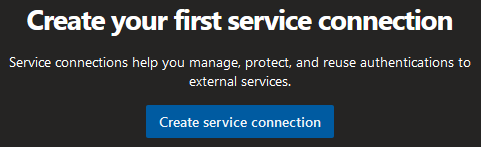
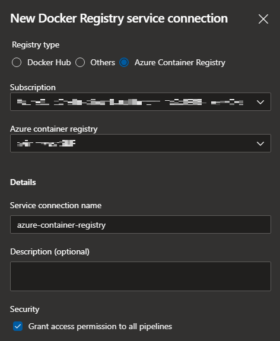
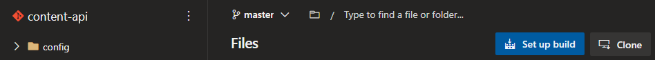

# Containerizing Legacy Apps

*The following material is inspired by [Microsoft's Cloud Native in a Day](https://github.com/microsoft/Cloud-Native-In-a-Day).*

*Part of that content has been adapted to fit the scope of this hands-on lab.*

**Duration:** 90 Minutes

- [Containerizing Legacy Apps](#containerizing-legacy-apps)
  - [Setup Azure](#setup-azure)
    - [Azure Cloud Shell](#azure-cloud-shell)
    - [Create a Resource Group](#create-a-resource-group)
    - [Generate SSH Key Pair](#generate-ssh-key-pair)
    - [Create a Service Principal](#create-a-service-principal)
    - [Clone Workshop Files](#clone-workshop-files)
    - [Deploy Azure Resources](#deploy-azure-resources)
  - [Setup Azure DevOps](#setup-azure-devops)
    - [Create a Project](#create-a-project)
    - [Create Service Connections](#create-service-connections)
    - [Create Repositories](#create-repositories)
    - [Push Source Code to New Repositories](#push-source-code-to-new-repositories)
    - [Init Script](#init-script)
    - [Complete Setup of Linux Virtual Machine](#complete-setup-of-linux-virtual-machine)
    - [Clone Repositories from Azure DevOps to Virtual Machine](#clone-repositories-from-azure-devops-to-virtual-machine)
  - [Run the Application](#run-the-application)
    - [MongoDB](#mongodb)
    - [Initialize the Database](#initialize-the-database)
    - [Initialize the API](#initialize-the-api)
    - [Initialize the Web App](#initialize-the-web-app)
    - [Browse the Application](#browse-the-application)
  - [Dockerize the Application](#dockerize-the-application)
    - [content-api Dockerfile](#content-api-dockerfile)
    - [content-init Dockerfile](#content-init-dockerfile)
    - [content-web Dockerfile](#content-web-dockerfile)
    - [Docker CLI, Registry, Repositories, and Tags](#docker-cli-registry-repositories-and-tags)
    - [Build the Docker Images](#build-the-docker-images)
    - [Run the Dockerized Application](#run-the-dockerized-application)
    - [Commit the Dockerfiles](#commit-the-dockerfiles)
  - [Docker Compose](#docker-compose)
  - [Push Docker Images to Azure Container Registry](#push-docker-images-to-azure-container-registry)
  - [Setup Continuous Integration](#setup-continuous-integration)
    - [azure-pipelines.yml](#azure-pipelinesyml)
    - [Set up build](#set-up-build)
  - [Cleanup](#cleanup)

## Setup Azure

### Azure Cloud Shell

1. Start a new Cloud Shell instance by selecting the `>_` icon located at the top right of the portal.

    

2. An in-window session will appear at the bottom of the browser.  Choose whichever shell you are most comfortable with.  This workshop will go with `Bash`.

     

### Create a Resource Group

A resource group is an Azure construct that holds all 'common' components that share the same lifecycle.  A resource group can be created using the following command:

```sh
# schema
az group create --location <LOCATION> --name aw-cla-<SUFFIX>
```

- `LOCATION` - choose a location that works for you
- `SUFFIX` - this suffix is to ensure resources are unique

```sh
# example
az group create --location canadacentral --name aw-cla-acme
```

Upon completion, the resource group should appear in the Azure portal.


### Generate SSH Key Pair

Later in this workshop a Linux virtual machine will be provisioned.  To access this virtual machine securely, the SSH protocol will be used.  An SSH key pair can be generated via the following command:

```sh
# schema
ssh-keygen -t <TYPE> -b <BITS> -C <COMMENT>
```

- `TYPE` - type of key to create
- `BITS` - number of bits in the key to create
- `COMMENT` - a comment to identity the key

```sh
# example
ssh-keygen -t rsa -b 2048 -C $(whoami)@workshop
```

During key generation you will be asked to provide a number of inputs.  Refer to this table for a default experience:

| Prompt                                                        | Action         |
| :------------------------------------------------------------ | :------------- |
| Enter file in which to save the key (/home/****/.ssh/id_rsa): | `<ENTER>`      |
| Enter passphrase (empty for no passphrase):                   | `<PASSPHRASE>` |
| Enter same passphrase again:                                  | `<PASSPHRASE>` |

Example output:

```text
****@Azure:~$ ssh-keygen -t rsa -b 2048 -C $(whoami)@workshop
Generating public/private rsa key pair.
Enter file in which to save the key (/home/****/.ssh/id_rsa):
Enter passphrase (empty for no passphrase):
Enter same passphrase again:
Your identification has been saved in /home/****/.ssh/id_rsa.
Your public key has been saved in /home/****/.ssh/id_rsa.pub.
The key fingerprint is:
SHA256:Ugf+eiLgeS9HnqmwVruaPLHk2C+UQoDymqYSiUSJips ****@workshop
The key's randomart image is:
+---[RSA 2048]----+
|o .     .        |
|=o     . .       |
|=o      o .      |
|o.o    . o       |
|oB  ... S .      |
|E...=o....       |
|o. B++o+oo.      |
|o ..B=oo=o       |
|.  .==+=.        |
+----[SHA256]-----+
```

With the above actions a new hidden directory is created with a new SSH key pair:

```sh
****@Azure:~$ ls -al .ssh/
total 16
drwx------  2 **** **** 4096 Oct 14 22:14 .
drwxr-xr-x 10 **** **** 4096 Oct 14 22:14 ..
-rw-------  1 **** **** 1766 Oct 14 22:14 id_rsa
-rw-r--r--  1 **** ****  394 Oct 14 22:14 id_rsa.pub
```

- `id_rsa` - private key
- `id_rsa.pub` - public key

### Create a Service Principal

A Service Principal is security identity within Azure Active Directory.  It can be seen as 'functional id' that should be given a minimum permission set to perform a task.  The service principal created here will be used to authenticate between Azure DevOps and Azure Container Registry as well as dynamically manage resources.

The following command will create a service principal for a particular subscription where the output is redirected to a text file for convenience:

```sh
# schema
az ad sp create-for-rbac --role="Contributor" --scopes="/subscriptions/<ID>" --name="http://aw-cla-sp-<SUFFIX>" > ./sp
```

- `ID` - subscription identifier that can be retrieved via:

  ```sh
  # schema
  az account list --output tsv --query [0].id
  ```

  ```sh
  # example
  ****@Azure:~$ az account list --output tsv --query [0].id
  aaaaaaaa-bbbb-cccc-dddd-eeeeeeeeeeee
  ```

- `SUFFIX` - this suffix is to ensure resources are unique

```sh
# example
az ad sp create-for-rbac --role="Contributor" --scopes="/subscriptions/aaaaaaaa-bbbb-cccc-dddd-eeeeeeeeeeee" --name="http://aw-cla-sp-acme" > ./sp
```

```sh
# example
****@Azure:~$ cat ./sp
{
  "appId": "c4faa785-66a5-426a-83d7-6310d81cdaba",
  "displayName": "aw-cla-sp-acme",
  "name": "http://aw-cla-sp-acme",
  "password": "6T_fsx0J23U2i0EE0Vn7LNi.xCcgxTEWUp",
  "tenant": "436da2cb-facd-4548-8e07-863dbfb2c374"
}
```

### Clone Workshop Files

1. Download the workshop files to the cloud shell session via `git`:

    ```sh
    git clone https://github.com/alithya/containerizing-legacy-apps.git
    ```

2. Remove the `.git` folder.  The reasoning will become evident later.

    ```sh
    rm -rf ./containerizing-legacy-apps.git/.git
    ```

### Deploy Azure Resources

The workshop files have been prepared to deploy all the necessary Azure resources that will be needed.

Two parameters, `suffix` and `virtual_machine_public_key`, need to configured in `azuredeploy.parameters.json` before deploying.

1. Retrieve the public key from `.ssh/id_rsa.pub`:

    ```sh
    ****@Azure:~$ cat .ssh/id_rsa.pub
    ssh-rsa (...) $(whoami)@workshop
    ```

    Copy this value `ssh-rsa (...) $(whoami)@workshop` to the clipboard.

2. Navigate to the `azuredeploy` directory:

    ```sh
    cd containerizing-legacy-apps/azuredeploy/
    ```

3. Open `azuredeploy.parameters.json` using `code`:

    ```sh
    code azuredeploy.parameters.json
    ```

    

     - Replace `<SUF>` with any three alphanumeric combination
     - Replace `ssh-rsa AAAAB3N(...)FXDrx6Z $(whoami)@workshop` with value from clipboard

4. `Save` and `Close Editor` using the three dots located at the top right of the cloud shell:

    

5. Create the Azure resources via ARM template deployment:

    ```sh
    # schema
    az deployment group create --resource-group <RESOURCE_GROUP> --template-file azuredeploy.json --parameters azuredeploy.parameters.json
    ```

      - `RESOURCE_GROUP` - name of resource group from above (case sensitive)

    ```sh
    # example
    az deployment group create --resource-group aw-cla-acme --parameters azuredeploy.parameters.json --template-file azuredeploy.json
    ```

    This will take 5-10 minutes.  On successful deployment you should see seven resources:

    

## Setup Azure DevOps

Microsoft's Azure DevOps is a platform that can provide an all-in-one solution to an application's lifecycle.  This workshop will leverage its DevOps capabilities, as well as its native integration with Azure, to setup a `Continuous Integration/Continuous Delivery` (CI/CD) pipeline for a sample application.

For this workshop, a sample application consisting of a website (frontend), an API layer (middleware), and a database (backend) will be used.  The source code for this can be found within the `content` directory:

```text
containerizing-legacy-apps
  content
  ├── content-api
  ├── content-init
  └── content-web
```

In a new browser tab, navigate to [Azure DevOps](https://dev.azure.com/) and login using a Microsoft account of your choosing.  Azure DevOps will walk you through creating an account if you have never logged in before.

### Create a Project

In Azure DevOps, create a new project by selecting `+ New Project` located near the top right.


Fill in the details in the `Create new project` panel:

- `Project name` - aw-cla-`<SUF>`
- `Visibility` - Private
- `Advanced`
  - `Version Control` - Git
  - `Work item process` - Agile


Click `Create` to create the new project.

### Create Service Connections

In this step a Service Connection will be created to establish a secure link between Azure DevOps and Azure.  This service connection will be used to manage Azure resources from Azure DevOps.  The service principal created earlier will be used to do this.

1. Located at the bottom left of your Azure DevOps session, click on the gear icon to access `Project settings`:

    |                  Showing less information                  |                  Showing more information                  |
    | :--------------------------------------------------------: | :--------------------------------------------------------: |
    |  |  |

2. Select `Service connections` under `Pipelines` followed by `Create service connection`:

    
    

3. In the `New service connection` panel select or search for `azure resource manager`

    

    Click `Next` to proceed.

4. For the `Authentication method`, choose `Service principal (manual)`:

    

    Click `Next` to proceed.

5. Navigate back to your cloud shell instance.  Reconnect if necessary.

    

    In cloud shell run the following commands to retrieve some key information:

    ```sh
    # subscription id
    az account list --output tsv --query [0].id

    # subscription name
    az account list --output tsv --query [0].name

    # service principal
    cat ./sp
    ```

    

    Fill in the details in the `New Azure service connection` panel:

    - `Subscription Id`
    - `Subscription Name`
    - `Authentication`
      - `Service Principal Id` - appId
      - `Credential` - Service principal key
      - `Service principal key` - password
      - `Tenant ID` - tenant

    Click `Verify` to verify.

    - `Details`
      - `Service connection name` - azure-cloud

    

    Click `Verify and save`.

6. Create another service connection by selecting `New service connection`.  In the resulting panel select or search for `docker registry`

    

    Click `Next` to proceed.

7. Fill in the details in the `New Docker Registry service connection` panel:

    - `Registry type` - Azure Container Registry
    - `Subscription` - should auto-populate
    - `Azure container registry` - azimmwksh`<SUF>`
    - `Details`
      - `Service connection name` - azure-container-registry

    

    Click `Save` to proceed.

### Create Repositories

Next, create repositories for each of the three application components.  Repeat the following steps for each component `content-api`, `content-init`, and `content-web`:

1. Select `Repos`.

    

2. Using the repository dropdown menu, select `+ New repository`.

    

3. Fill in the details in the `Create a repository` panel

    - `Repository type` - Git
    - `Repository name`
      - content-api
      - content-init
      - content-web
    - - [ ] `Add a README` (uncheck)
    - `Add a .gitignore: None`

    

    Click `Create` to proceed.

### Push Source Code to New Repositories

Starting with `content-web` as this should be the currently selected repository, click on `Generate Git Credentials` to receive a `Personal Access Token`.  Save this password somewhere, like notepad.


For convenience, configure git globally with your username and email, and then cache them.

```sh
git config --global user.email "you@somewhere.com"
git config --global user.name "Your Name"
git config --global credential.helper cache
```

Using the cloud shell, push the source code for each application component using the following steps:

1. Change directories to `content-web`:

    ```sh
    cd content/content-web
    ```

2. Initial a new local git repository:

    ```sh
    git init
    ```

3. Add all objects in the directory:

    ```sh
    git add .
    ```

4. Provide a commit commment:

    ```sh
    git commit -m "Initial commit"
    ```

5. Copy the `HTTPS` repository address from Azure DevOps.

6. Point the new local git repository to this Azure DevOps remote repository:

    ```sh
    # example
    git remote add origin https://<ORGANIZATION>@dev.azure.com/<ORGANIZATION>/aw-cla-acme/_git/content-web
    ```

7. Push everything:

    ```sh
    git push --set-upstream origin --all
    ```

    You will be asked for a password.  Copy your personal access token from earlier to the terminal and `<ENTER>`.

    **NB:** The pasted password will not show anything and you should only need to do this one time.

### Init Script

In this workshop, the Linux virtual machine deployed earlier will be used in two ways to run the sample application:

- Directly from the OS (virtual machine used in traditional sense); and

- As Docker containers (virtual machine treated as a `Docker Host`)

To demonstrate this, a number of packages and tools must be first installed and configured.  Running these commands takes away from the scope of this workshop so instead a shell script, `init.sh`, has been prepared to do this for you.

1. In the cloud shell navigate to the `azuredeploy/post` directory located within the workshop files:

    ```sh
    cd containerizing-legacy-apps/azuredeploy/post/
    ```

2. In the `Azure Portal`, navigate to the virtual machine that was deployed earlier and copy the `Public IP address`:

    

3. Copy the `init.sh` shell script to the virtual machine using `secure copy` (note that secure copy will make use of the previously generated SSH key pair):

    ```sh
    # schema
    scp <FILE> <USERNAME>@<HOSTNAME>:<DESTINATION>
    ```

    - `FILE` - ./init.sh
    - `USERNAME` - azroot, set from azuredeploy.parameters.json
    - `HOSTNAME` - public IP address
    - `DESTINATION` - local path on destination

    ```sh
    # example
    scp ./init.sh azroot@20.43.17.135:/home/azroot/
    ```

    This should be the first time you establish a connection to the newly provisioned virtual machine.  You will be prompted twice for input:

    - Answer `yes` when asked to continue connecting; and
    - Provide the `passphrase` associated with the SSH private key generated earlier

    ```text
    The authenticity of host '20.43.17.135 (20.43.17.135)' can't be established.
    ECDSA key fingerprint is SHA256:xgZ5qDGFHgQCpFLFvNotHg+d5VqGKLEs1F7ecjJycds.
    Are you sure you want to continue connecting (yes/no)? yes
    Enter passphrase for key '/home/****/.ssh/id_rsa':
    ```

    The script should be copied over successfully with an output similar to this:

    ```text
    init.sh               100%  664     0.7KB/s   00:00
    ```

### Complete Setup of Linux Virtual Machine

Establish a `secure shell` connection using the following command:

```sh
# schema
ssh <USERNAME>@<PUBLIC_IP_ADDRESS>
```

```sh
# example
ssh azroot@20.43.17.135
```

You will be prompted for a passphrase once again.  Verify that the `init.sh` shell script is there:

```sh
ls -al
```

Complete the setup of packages and tools by running the script with:

```sh
yes | sudo ./init.sh
```

The process should take a few minutes to complete.  Verify the various technologies are installed:

```sh
mongo --version
nodejs --version
npm --version
docker --version
docker-compose --version
```

### Clone Repositories from Azure DevOps to Virtual Machine

To work with the sample application on the virtual machine the source code must be cloned locally.  Like earlier, run the following commands to configure git globally:

```sh
git config --global user.email "you@somewhere.com"
git config --global user.name "Your Name"
git config --global credential.helper cache
```

1. In Azure DevOps, navigate to any one of the three repositories' files.

    

2. Click on the `Clone` button to reveal the `Clone Repository` panel.

    

    

    Copy the `HTTPS` URL value.

3. Clone the repository on the virtual machine:

    ```sh
    # example
    git clone https://<ORGANIZATION>@dev.azure.com/<ORGANIZATION>/aw-cla-acme/_git/content-web
    ```

    You will be asked for a password which is the personal access token from earlier.

4. Repeat this two more times for the other content repositories.

## Run the Application

Before making any changes that will run the application in a container, verify that it runs normally.

### MongoDB

Connect to the locally running mongo instance on the virtual machine and test out some basic commands:

```sh
mongo
show dbs
quit()
```

Here is what you should see:

```text
$ mongo
MongoDB shell version v4.4.1
connecting to: mongodb://127.0.0.1:27017/?compressors=disabled&gssapiServiceName=mongodb
Implicit session: session { "id" : UUID("eca0b5b4-e715-4571-a11a-8cb007cd7acb") }
MongoDB server version: 4.4.1
Welcome to the MongoDB shell.
For interactive help, type "help".
For more comprehensive documentation, see
        https://docs.mongodb.com/
Questions? Try the MongoDB Developer Community Forums
        https://community.mongodb.com
---
The server generated these startup warnings when booting:
        2020-10-16T19:49:15.048+00:00: Using the XFS filesystem is strongly recommended with the WiredTiger storage engine. See http://dochub.mongodb.org/core/prodnotes-filesystem
        2020-10-16T19:49:15.797+00:00: Access control is not enabled for the database. Read and write access to data and configuration is unrestricted
        2020-10-16T19:49:15.797+00:00: /sys/kernel/mm/transparent_hugepage/enabled is 'always'. We suggest setting it to 'never'
---
---
        Enable MongoDB's free cloud-based monitoring service, which will then receive and display
        metrics about your deployment (disk utilization, CPU, operation statistics, etc).

        The monitoring data will be available on a MongoDB website with a unique URL accessible to you
        and anyone you share the URL with. MongoDB may use this information to make product
        improvements and to suggest MongoDB products and deployment options to you.

        To enable free monitoring, run the following command: db.enableFreeMonitoring()
        To permanently disable this reminder, run the following command: db.disableFreeMonitoring()
---
> show dbs
admin   0.000GB
config  0.000GB
local   0.000GB
> quit()
```

### Initialize the Database

Navigate to the `content-init` directory and initialize the database against the locally running Mongo DB instance:

```sh
cd content-init
npm install
nodejs server.js
```

Now confirm that the database contains data:

```sh
mongo

show dbs
use contentdb
show collections
db.speakers.find()
db.sessions.find()
quit()
```

### Initialize the API

Navigate to the `content-api` directory and initialize the service as a background process:

```sh
cd ../content-api
npm install
nodejs server.js &
```

You should see the following output, press `<ENTER>` to regain focus:

```text
Listening on port 3001
Connected to MongoDB
<ENTER>
```

With the database running you can now request content via the locally published APIs, using `curl`:

```sh
curl http://localhost:3001/sessions
curl http://localhost:3001/speakers
```

### Initialize the Web App

Navigate to the `content-web` directory and build the web app:

```sh
cd ../content-web
npm install
ng build
```

To view the web app through a web browser, the source code must be edited to point to the public IP address provided by Azure.  This is made clear by running the following command:

```sh
cat app.js | grep CONTENT_API_URL
```

This command concatenates the javascript `app.js` file, piping the output to `grep` which searches for the string `CONTENT_API_URL` and prints all instances of it to the terminal.  Since there is only one instance you should see:

```text
const contentApiUrl = process.env.CONTENT_API_URL || "http://localhost:3001";
```

Cleary this points to `localhost`, which is inaccessible via a web browser.

Using `nano` or `vi`, edit `line 9` of `app.js`.  If you do not have experience using these text editors in the terminal, you can run this command that will do it for you:

```sh
sed -i 's/localhost/20.43.17.135/g' ./app.js
```

Verify that `line 9` has been updated:

```sh
cat app.js | grep CONTENT_API_URL
```

Once satisfied, start the web app as a background process and press `<ENTER>` to regain focus:

```sh
node app.js &
<ENTER>
```

The web app's port can be found by inspecting `app.js` or running the following command:

```sh
cat app.js | grep PORT
```

Verify the web app is running locally:

```sh
curl http://localhost:3000
```

If successful, the following HTML should be returned:

```html
<!doctype html>
<html class="no-js" lang="en">
<head>
  <meta charset="utf-8"/>
  <title>Contoso Neuro 2017 Conference </title>
  <base href="/">
  <link rel="image_src" type="image/gif" href="https://techintersection.comassets/images/Contoso Neuro 2016_2015_banner.gif"/>

  <link rel="stylesheet" href="assets/stylesheets/font-awesome.min.css"/>
  <link rel="stylesheet" href="assets/stylesheets/app.css"/>
   <link rel="shortcut icon" href="assets/favicon.ico"/>
</head>
<body itemscope itemtype="http://data-vocabulary.org/Event" class="f-topbar-fixed">
  <app-root></app-root>
<script src="runtime.js" defer></script><script src="polyfills-es5.js" nomodule defer></script><script src="polyfills.js" defer></script><script src="styles.js" defer></script><script src="vendor.js" defer></script><script src="main.js" defer></script></body>
```

### Browse the Application

Open a web browser and navigate to the URL, substituting `<PUBLIC_IP_ADDRESS>`:

```sh
# schema
http://<PUBLIC_IP_ADDRESS>:3000
```

```sh
# example
http://20.43.17.135:3000
```

Click on `Speakers` and `Sessions` located near the top right to see the Mongo DB data from `content-init` visualized:


Once satisfied, return the cloud shell and stop all relevant processes:

```sh
killall nodejs
killall node
```

## Dockerize the Application

In this section `Dockerfiles` will be created for each component to produce `Docker Images` which then can be used to run `Docker Containers`.  First, check that Docker is configured properly:

```sh
docker version
```

The output should closely resemble the following:

```text
Client: Docker Engine - Community
 Version:           19.03.13
 API version:       1.40
 Go version:        go1.13.15
 Git commit:        4484c46d9d
 Built:             Wed Sep 16 17:02:36 2020
 OS/Arch:           linux/amd64
 Experimental:      false
Got permission denied while trying to connect to the Docker daemon socket at unix:///var/run/docker.sock: Get http://%2Fvar%2Frun%2Fdocker.sock/v1.40/version: dial unix /var/run/docker.sock: connect: permission denied
```

Looking at the output shows that only the `client` returned.  This is due to running Docker without elevated privileges (i.e. `sudo`).  Remove this requirement permanently by adding the current user the docker group:

```sh
sudo usermod -aG docker $USER
```

The current session will need to be refreshed for the changes to take effect.  Disconnect using the `exit` command, then reconnect.

```sh
docker version
```

The output should now include the `server` portion:

```text
Client: Docker Engine - Community
 Version:           19.03.13
 API version:       1.40
 Go version:        go1.13.15
 Git commit:        4484c46d9d
 Built:             Wed Sep 16 17:02:36 2020
 OS/Arch:           linux/amd64
 Experimental:      false

Server: Docker Engine - Community
 Engine:
  Version:          19.03.13
  API version:      1.40 (minimum version 1.12)
  Go version:       go1.13.15
  Git commit:       4484c46d9d
  Built:            Wed Sep 16 17:01:06 2020
  OS/Arch:          linux/amd64
  Experimental:     false
 containerd:
  Version:          1.3.7
  GitCommit:        8fba4e9a7d01810a393d5d25a3621dc101981175
 runc:
  Version:          1.0.0-rc10
  GitCommit:        dc9208a3303feef5b3839f4323d9beb36df0a9dd
 docker-init:
  Version:          0.18.0
  GitCommit:        fec3683
```

The following sections will provide instructions that use the `vi` text editor but the commands will be kept to a minimum.

**NB:**

```text
Dockerfiles are a set of layered instructions that when executed result in a Docker Image.
If not careful, the resulting image can be a larger file size than intended. After all, containers
should be lightweight. An example of this is using the SDK to run the application instead of a
runtime environment. This would make the image larger than is necessary with all the bells and
whistles that come with an SDK.

Dockerfile optimization is another topic entirely and the resulting instructions are usually more
complex for someone starting out.  However, this workshop will do some layering for optimization
and the resulting Dockerfiles should prove to be good starting points for future applications.
```

### content-api Dockerfile

Navigate to the `content-api` directory.

1. Initialize a new Dockerfile file:

    ```sh
    vi Dockerfile
    ```

2. Press `<i>` for `-- INSERT --` mode

3. Copy these contents for the Dockefile

    ```Dockerfile
    FROM node:erbium AS build
    WORKDIR /usr/src/app
    COPY . .
    RUN npm install

    FROM node:alpine
    RUN apk --update-cache add curl
    WORKDIR /usr/src/app
    COPY --from=build /usr/src/app .
    EXPOSE 3001
    CMD [ "npm", "start" ]
    ```

4. To paste the contents in `vi`, you can either
    - `right click` using the mouse and select `paste`; or
    - `shift + insert` using the keyboard

5. Press `<ESC>` to return to command mode

6. Save and quit via `<ZZ>` (hold `shift` and press `z` twice)

Here is a table that references each line of the Dockerfile providing some commentary:

| Instruction                        | Comments                                                                                                           |
| :--------------------------------- | :----------------------------------------------------------------------------------------------------------------- |
|                                    | Temporary layer to build the application.                                                                          |
| `FROM node:erbium AS build`        | Use a pre-built image based on Debian (same as virtual machine) with the same version of nodejs already installed. |
| `WORKDIR /usr/src/app`             | Set the working directory in the image.                                                                            |
| `COPY . .`                         | Copy all files and directories from the host to the working directory in the image.                                |
| `RUN npm install`                  | Install content-api dependencies from package.json in the image.                                                   |
|                                    |                                                                                                                    |
|                                    | Final layer to run the application.                                                                                |
| `FROM node:alpine`                 | Use a pre-built image based on Alpine (a much smaller than most linux distribution).                               |
| `RUN apk --update-cache add curl`  | Install curl in the image.                                                                                         |
| `WORKDIR /usr/src/app`             | Set the working directory in the image.                                                                            |
| `COPY --from=build /usr/src/app .` | Copy the artifacts from build stage layer to this layer.                                                           |
| `EXPOSE 3001`                      | Set the port that the container will listen to when running.                                                       |
| `CMD [ "npm", "start" ]`           | Set the default executing command when the container starts.                                                       |

### content-init Dockerfile

Navigate to the `content-init` directory.  Create the Dockerfile in the same way as you did for `content-api`.  The Dockerfile is very similar:

```Dockerfile
FROM node:erbium AS build
WORKDIR /usr/src/app
COPY . .
RUN npm install

FROM node:alpine
WORKDIR /usr/src/app
COPY --from=build /usr/src/app .
CMD [ "npm", "start" ]
```

### content-web Dockerfile

Navigate to the `content-web` directory and create its Dockerfile:

```Dockerfile
FROM node:erbium AS build
WORKDIR /usr/src/app
COPY . .
RUN npm install -g @angular/cli@~8.3.29
RUN npm install --save-dev @angular-devkit/build-angular
RUN ng build

FROM node:alpine
RUN apk --update-cache add curl
WORKDIR /usr/src/app
COPY --from=build /usr/src/app .
EXPOSE 3000
CMD [ "node", "app.js" ]
```

### Docker CLI, Registry, Repositories, and Tags

With all three Dockerfiles created, it's now time to build their respective images.  Building an image is accomplished via the [Docker CLI](https://docs.docker.com/engine/reference/commandline/cli/), which allows for setting various options.  The command this workshop will use is the following:

```sh
# schema
docker build --tag <TAG> .
```

- `TAG` - gives the Docker image a name, that is split into `REPOSITORY:VERSION`
- `.` - the build context where the Dockerfile is located

At this moment, a few definitions are needed.  When you ran `docker version` earlier, the output showed `Client` and `Server`.  In addition to building images, running containers, etc., the Docker `server` also runs a local Docker `registry`.  This registry is a storage mechanism for hosting repositories (Docker images that have been built locally).  Docker images can have `multiple versions`, where by default, the value is `latest`.

Here is a visual representation of this hierarchy:

```text
host
└── dockerd (docker daemon, the server)
    └── registry
        └── repositories
            ├── image0
            │   ├── latest
            │   ├── 0.1.0
            │   └── 0.2.0
            └── image1
                └── latest
```

Go ahead and run the following command to list all repositories and their tags that are currently within the registry:

```sh
docker images
```

You should see only the print out of column headers:

```text
REPOSITORY          TAG                 IMAGE ID            CREATED             SIZE
```

The above definitions will be made clear in the next section.

### Build the Docker Images

Navigate to the `content-api` directory.  Run the following command to build its Docker image:

```sh
docker build --tag content-api .
```

The process will take about a minute to complete.  Once finished the last two lines should read:

```text
Successfully built <IMAGE ID>
Successfully tagged content-api:latest
```

- `IMAGE ID` - unique 'digest' identifying this image

Run `docker images` again and it should result in something similar (your `IMAGE ID`s will be different):

```text
REPOSITORY          TAG                 IMAGE ID            CREATED              SIZE
content-api         latest              0742ddba60e5        About a minute ago   129MB
<none>              <none>              504851e81317        About a minute ago   929MB
node                alpine              fa2fa5d4e6f4        47 hours ago         117MB
node                erbium              1f560ce4ce7e        5 days ago           918MB
```

Each of the four images corresponds to instructions within `content-api`'s Dockerfile.  The takeaway here is the one image which has neither a repository nor tag value (`<none>`).  This particular image is the intermediate layer resulting from the multi-stage layout of the Dockerfile.

Navigate to the other two components and complete their respective builds.  Be sure to change their respective tag values as using the same value will over that Docker image.

```sh
docker build --tag content-init .
docker build --tag content-web .
```

**NB:**

```text
The Docker image build for content-web will take approximately 4-5 minutes.
```

### Run the Dockerized Application

Two final pieces must be created before the application can be fully run as containers:

1. Docker bridge network

    - allows containers connected on the same bridge network to communicate but also providing isolation from other containers which are not connected

    - ```sh
      docker network create az
      ```

2. Containerized instance of MongoDB

    - instead of using the host instance of MongoDB that was installed earlier

    - ```sh
      sudo service mongod stop
      ```

    - ```sh
      docker container run --detach --name mongo --net az --publish 27017:27017 mongo
      ```

    This will start a container named 'mongo' as a background process.  Additionally, it will attach the container to the `az` bridge network and publish port `27017` (map the host port to the container port, i.e., `host:container`).  Running the following command shows all docker processes (there should only be one):

    ```sh
    docker ps
    ```

3. Run a container for `content-init`:

    ```sh
    docker container run --name init --net az content-init
    ```

    Oops! Looks like something is immediately wrong.  Not a great start:

    ```text
    > content-init@1.0.0 start /usr/src/app
    > node server.js

    Clean Sessions table
    (node:17) Warning: Accessing non-existent property 'count' of module exports inside circular dependency
    (Use `node --trace-warnings ...` to show where the warning was created)
    (node:17) Warning: Accessing non-existent property 'findOne' of module exports inside circular dependency
    (node:17) Warning: Accessing non-existent property 'remove' of module exports inside circular dependency
    (node:17) Warning: Accessing non-existent property 'updateOne' of module exports inside circular dependency
    Could not connect to MongoDB!
    MongoNetworkError: connect ECONNREFUSED 127.0.0.1:27017
    npm ERR! code ELIFECYCLE
    npm ERR! errno 255
    npm ERR! content-init@1.0.0 start: `node server.js`
    npm ERR! Exit status 255
    npm ERR!
    npm ERR! Failed at the content-init@1.0.0 start script.
    npm ERR! This is probably not a problem with npm. There is likely additional logging output above.

    npm ERR! A complete log of this run can be found in:
    npm ERR!     /root/.npm/_logs/2020-10-19T01_36_01_998Z-debug.log
    ```

    Actually, this is expected as content-init is configured to connect to a local MongoDB instance, if not overridden by an environment variable `MONGODB_CONNECTION`:

    ```sh
    cat content-init/config/config.js
    ```

    ```text
    exports.appSettings = {
      db: (function() {
        return process.env.MONGODB_CONNECTION || 'mongodb://localhost:27017/contentdb';
      })()
    };
    ```

    Remove the failed container by name:

    ```sh
    docker ps -a
    docker container rm init
    ```

    Modify the `docker container run` command to include the environment variable and run as background process:

    ```sh
    docker container run --detach --env MONGODB_CONNECTION=mongodb://mongo:27017/contentdb --name init --net az content-init
    ```

    Verify the container is running properly now:

    ```sh
    docker ps
    docker container logs init
    ```

    **NB:** The container for content-init will actually exit once the data has been seeded.  Running `docker container logs init` will help to see that it was successful.  This was to demonstrate that once the data has been seeded into the Mongo DB instance, the container no longer needs to be running.

4. Run a container for `content-api`:

    ```sh
    docker container run --name api --net az --publish 3001:3001 content-api
    ```

    Seems like the same error!  You know what to do now:

    ```sh
    docker ps -a
    docker container rm api
    ```

    Modify the `docker container run` command to include the environment variable and run as background process:

    ```sh
    docker container run --detach --env MONGODB_CONNECTION=mongodb://mongo:27017/contentdb --name api --net az --publish 3001:3001 content-api
    ```

    Verify the container is running properly now:

    ```sh
    docker ps
    docker container logs api
    curl http://localhost:3001/speakers
    ```

5. Run a container for `content-web`:

    ```sh
    docker container run --detach --name web --net az --publish 3000:3000 content-web
    ```

    Using a web browser, navigate to the URL using the public IP address:

    ```sh
    # example
    http://20.43.17.135:3000
    ```

    You should now be able to view the website's landing page.  Click on `Speakers` and `Sessions` to verify that  data is being loaded.  Turns out, no data is being retrieved!

    Since `content-api` is now running in a container, content-web needs to point to the correct `CONTENT_API_URL`.  If you will recall:

    ```sh
    cat content-web/app.js | grep CONTENT_API_URL
    ```

    Modify content-web's Dockerfile to include the ability to pass the environment variable:

    ```diff
      FROM node:erbium AS build
      WORKDIR /usr/src/app
      COPY . .
      RUN npm install -g @angular/cli@~8.3.29
      RUN npm install --save-dev @angular-devkit/build-angular
      RUN ng build

      FROM node:alpine
      RUN apk --update-cache add curl
      WORKDIR /usr/src/app
      COPY --from=build /usr/src/app .
    + ENV CONTENT_API_URL http://localhost:3001
      EXPOSE 3000
      CMD [ "node", "app.js" ]
    ```

    Stop and remove the container running content-web:

    ```sh
    docker stop web
    docker rm web
    ```

    Rebuild the image:

    ```sh
    docker build --tag content-web .
    ```

    Modify the `docker container run` command to include the environment variable and run as background process:

    ```sh
    docker container run --detach --env CONTENT_API_URL=http://api:3001 --name web --net az --publish 3000:3000 content-web
    ```

    Verify the application is finally working successfully.

### Commit the Dockerfiles

For each of the Dockerfiles created, commit and push them to their Azure DevOps repositories:

```sh
git add Dockerfile
git commit -m "Initial commit"
git push
```

If prompted for a password, enter your personal access token from earlier.

## Docker Compose

For a simple application, managing its containers and dependencies (environment variables, etc.) using just `docker container run` commands is certainly doable.  However, for a more advanced application with potentially many more containers and dependencies, this may not be feasible.  `Docker Compose` is a tool that defines and runs multi-container Docker applications.

1. Stop and remove all existing running containers:

    ```sh
    docker stop web api mongo
    docker rm web api mongo init
    ```

2. Navigate to your home directory `~` and create a new `docker-compose.yml` file:

    ```sh
    cd
    vi docker-compose.yml
    ```

    Fill this file with the following content:

    ```yaml
    version: '3'

    services:
      mongo:
        image: mongo
        restart: always
        volumes:
          - ./data:/data/db

      init:
        build: ./content-init
        image: content-init
        depends_on:
          - mongo
        environment:
          MONGODB_CONNECTION: mongodb://mongo:27017/contentdb

      api:
        build: ./content-api
        image: content-api
        depends_on:
          - mongo
        environment:
          MONGODB_CONNECTION: mongodb://mongo:27017/contentdb

      web:
        build: ./content-web
        image: content-web
        depends_on:
          - api
        environment:
          CONTENT_API_URL: http://api:3001
        ports:
          - '3000:3000'
    ```

    Compose uses a YAML file to define an application's services, where each service is defined by a Docker image that can have its own configurations and dependencies.  Compose will then bring up these services in the correct order with the correct configuration.

    The YAML file should be fairly self-explanatory but in case there is any confusion:

    - ```yaml
      # file format version
      version: 3'
      ```

    - ```yaml
      # define services
      services:
      ```

    - ```yaml
      # mongo service definition
      mongo:                 # service name
        image: mongo         # image to use
        restart: always      # restart policy; always restart if container stops
        volumes:
          - ./data:/data/db  # persist data from container to the host
      ```

    - ```yaml
      # init (and api) service defintion
      init:
        build: ./content-init                                  # Dockerfile build context
        image: content-init                                    # Docker image name
        depends_on:
          - mongo                                              # service dependency
        environment:
          MONGODB_CONNECTION: mongodb://mongo:27017/contentdb  # environment variable key-value pair
      ```

    - ```yaml
      # web service defintion
      web:
        build: ./content-web
        image: content-web
        depends_on:
          - api
        environment:
          CONTENT_API_URL: http://api:3001
        ports:
          - '3000:3000'  # port to publish
      ```

    - Notice `api` service does not require explicitly publishing port 3001.  This is because within its Dockerfile, the `EXPOSE` instruction allows communication on port 3001 for containers within the same network.  Since the application is working, port 3001 no longer needs to be publicly open.

3. Bring `up` all services with the following command:

    ```sh
    docker-compose --file docker-compose.yml --project-name az up --detach
    ```

    The explicit inclusion of `--file docker-compose.yml` is actually not required here.  As long as the command is executed within the same directory as `docker-compose.yml`, it does not need to be included (provided the YAML file is named `docker-compose.yml`).

    Compose will create a new network and attach all services to it (with the prefix of the project name):

    ```text
    Creating network "az_default" with the default driver
    Creating az_mongo_1 ... done
    Creating az_init_1  ... done
    Creating az_api_1   ... done
    Creating az_web_1   ... done
    ```

4. Navigate the web application via the browser and verify that it works as intended.

5. Bring `down` all services with the following:

    ```sh
    docker-compose --project-name az down
    ```

## Push Docker Images to Azure Container Registry

A Docker image is an `artifact` of a built Dockerfile, where by default, is stored within the local Docker registry running on the host machine.  In general, a dedicated container registry would be used as a single source of truth to distribute all images for all environments.  Azure Container Registry is a fully-managed, geo-replicated container management service.

To `push` images to Azure Container Registry (or any other registry), the image must be tagged to include the hostname of the registry.

1. Using the `Azure Portal`, navigate to the container registry deployed earlier and select `Access keys` under `Settings`:

    

2. Back on your virtual machine, login to the registry, substituting the information displayed on the `Access keys` blade:

    ```sh
    # schema
    docker login <LOGIN_SERVER> --username <USERNAME> --password <PASSWORD/PASSWORD2>
    ```

    ```sh
    # example
    docker login azimmwkshsuf.azurecr.io --username azimmwkshSUF --password lIT1PlwO43W1Y5l4CO8NVbia0g5REI+B
    ```

3. Apply additional tags to your existing docker images so that they can be pushed to the correct registry:

    ```sh
    # schema
    docker tag SOURCE_IMAGE[:TAG] TARGET_IMAGE[:TAG]
    ```

    ```sh
    # example
    docker tag content-api azimmwkshsuf.azurecr.io/content-api
    ```

    The tag can be omitted as the default value is assumed to be '`latest`'.  After tagging each component, run the following command to verify:

    ```sh
    docker images | grep content
    ```

    This should return an output similar to:

    ```text
    REPOSITORY                             TAG              IMAGE ID            CREATED             SIZE
    azimmwkshsuf.azurecr.io/content-web    latest           e7a43d86f6e0        22 hours ago        460MB
    content-web                            latest           e7a43d86f6e0        22 hours ago        460MB
    azimmwkshsuf.azurecr.io/content-init   latest           7b26ee6d0a01        24 hours ago        125MB
    content-init                           latest           7b26ee6d0a01        24 hours ago        125MB
    azimmwkshsuf.azurecr.io/content-api    latest           0742ddba60e5        31 hours ago        129MB
    content-api                            latest           0742ddba60e5        31 hours ago        129MB
    ```

4. Push each image to Azure Container Registry:

    ```sh
    # schema
    docker push <REPOSITORY>
    ```

    ```sh
    # example
    docker push azimmwkshsuf.azurecr.io/content-api
    docker push azimmwkshsuf.azurecr.io/content-init
    docker push azimmwkshsuf.azurecr.io/content-web
    ```

5. Back in the `Azure Portal`, under `Services`, select `Repositories` to see each image.  Each repository also has an additional blade that shows all associated tags:

    

6. Provide a different tag `v0` and push:

   ```sh
   # example
   docker tag content-api azimmwkshsuf.azurecr.io/content-api:v0
   docker push azimmwkshsuf.azurecr.io/content-api:v0
   ```

   Refresh the content-api repository blade:

    

## Setup Continuous Integration

This final task will be to setup continuous integration using Azure Pipelines.  With this setup, any changes made by a developer will automatically build and push a new Docker image to Azure Container Registry.

### azure-pipelines.yml

```text
The following pipeline definition is only an example.

As with any production setup, a proper branching model using pull requests should be implemented.
Example branching models include Trunk-Based Development (GitHub Flow) and GitFlow.

Additionally, a proper versioning scheme should be in place that works for your organization/projects.
Semantic Version is one popular choice.
```

Navigate to the `content-api` directory.

1. Initialize a new `azure-pipelines.yml` file:

    ```sh
    vi azure-pipelines.yml
    ```

2. Press `<i>` for `-- INSERT --` mode

3. Copy these contents for the azure-pipelines.yml:

    ```yaml
    name: 0.1.$(Rev:r)

    trigger:
      - master

    resources:
      - repo: self

    variables:
      tag: $(Build.BuildNumber)

    stages:
      - stage: Build
        displayName: Build and Push
        jobs:
          - job: Docker
            displayName: Build and Push Docker Image
            pool:
              vmImage: ubuntu-latest
            steps:
              - checkout: self
                fetchDepth: 1

              - task: Docker@2
                displayName: Build and push to Azure Container Registry
                inputs:
                  command: buildAndPush
                  repository: content-api
                  dockerfile: $(Build.SourcesDirectory)/Dockerfile
                  containerRegistry: azure-container-registry
                  tags: |
                    $(tag)
                    latest
    ```

4. To paste the contents in `vi`, you can either
    - `right click` using the mouse and select `paste`; or
    - `shift + insert` using the keyboard

5. Press `<ESC>` to return to command mode

6. Save and quit via `<ZZ>` (hold `shift` and press `z` twice)

7. Commit and push to Azure DevOps:

    ```sh
    git add azure-pipelines.yml
    git commit -m "Initial commit"
    git push
    ```

    If prompted for a password, enter your personal access token from earlier.

8. Repeat for the other two components, substituing `repository: content-api` with the correct name.

### Set up build

1. In `Azure DevOps`, navigate to each repository and click on `Set up build`:

    

2. In the next screen select `Run`:

    

3. Azure Pipelines will queue the first build and the YAML definition will take care of the rest:

    

4. After each build is complete, check Azure Container Registry to see the latest versions:

    

## Cleanup

Remove all resources that were provisioned for this workshop.

1. In the `Azure Portal`, navigate to the blade of your resource group and select `Delete resource group`:

    

    In the `Are you sure you want to delete "..."` panel, type in the name of your resource group to confirm.

    Click `Delete` to begin the removal process.

2. Remove the service principal create earlier:

    ```sh
    az ad sp delete --id "aw-cla-sp-acme"
    ```

This concludes the workshop.
